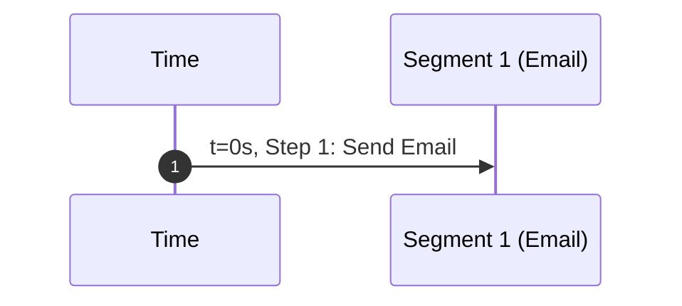
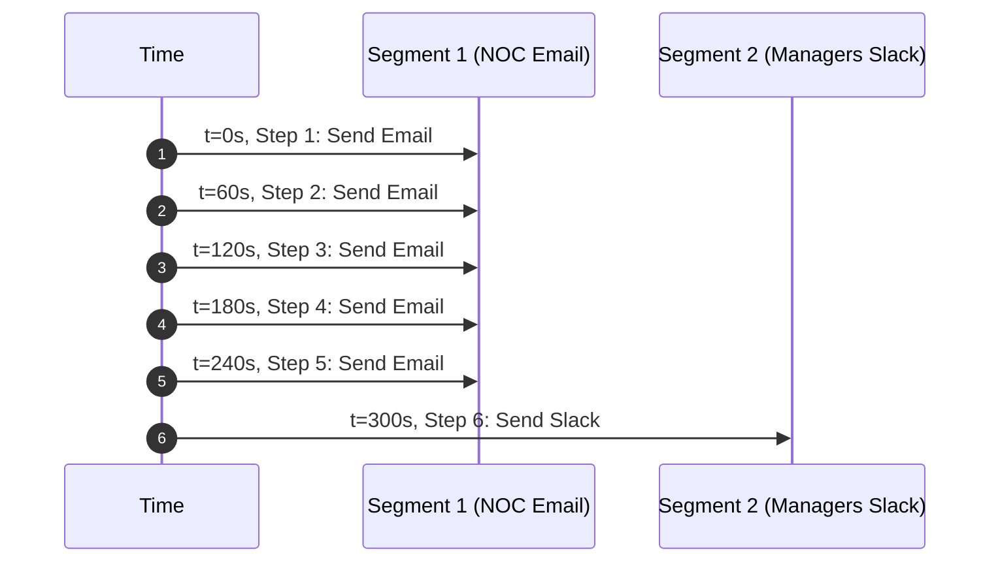
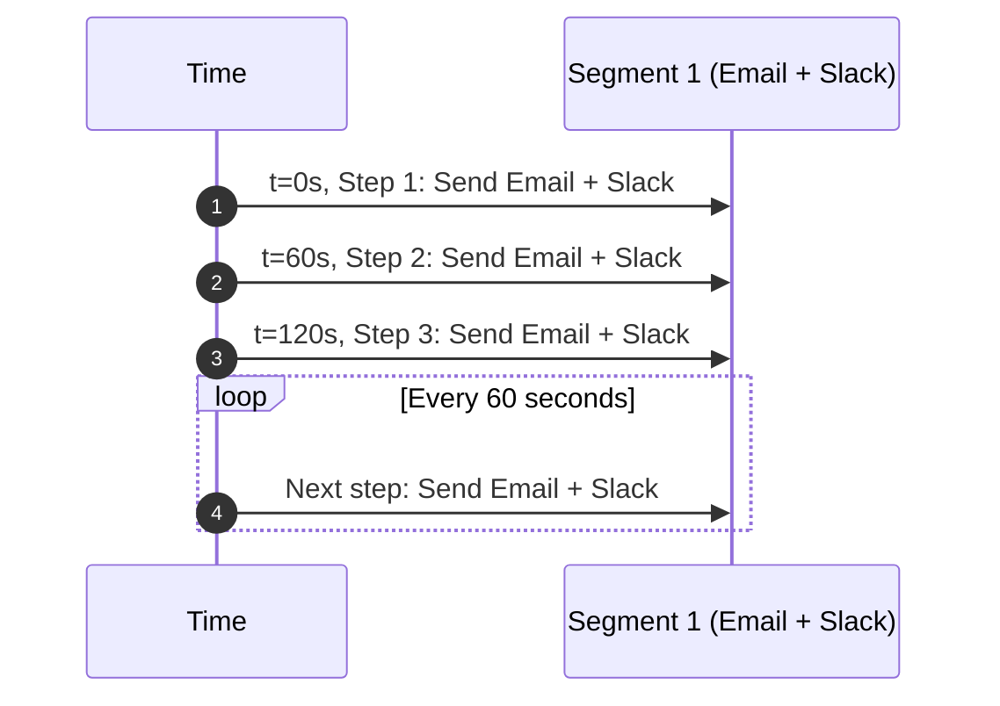

# Operations

With Alert **Operations**, you can use the same “who to notify and when” behavior in multiple Alert Rules.

You do not have to configure delays, repeats, and transport targets separately on each rule. You create an Operation one time, then attach it to each applicable rule.

An operation is not mandatory. Without one, an alert rule can start an alert, but it does not send notifications.

## Quick start

If you are new to alerting, start with this:

1. Create one operation with one segment.
2. Set **Steps from** to `1` and **Steps to** to `1`.
3. Set **Start** to `0` and **Step duration** to `60`.
4. Add one transport (for example, email).
5. Attach the operation to an alert rule.

This sends one notification immediately when the rule matches.

## What an Operation is

An Operation is a named set of one or more **segments**.

A segment defines a notification window and its targets. Each segment has:

- **Steps from**: the first step number this segment applies to
- **Steps to**: the last step number this segment applies to
  - Leave this empty to continue without limit.
- **Start**: delay before this segment starts, in seconds
- **Step duration**: time between each step, in seconds

Most people start with one segment.

Example:

- Steps from: `1`
- Steps to: `1`
- Start: `0`
- Step duration: `60`

## Transports used by Operations

Each segment contains its own list of notification targets:

- **Transports** (Slack, email, Telegram, and so on)
- **Transport groups** (a reusable group of transports)

This means you can:

- Send to one set of transports early (first segment)
- Send to a wider set later (second segment)

## Assigning an operation to a rule

When you create or edit an Alert Rule, select an **Operation**.

- If an operation is attached, notifications obey the operation's segments and transports.
- If no operation is attached, the rule can start alerts, but the system sends no notifications.

## How operations work in the backend (high level)

At a high level, the backend treats an operation as a reusable notification plan.

- An Alert Rule stores `alert_operation_id`, which points to the operation that it uses.
- An operation contains one or more segments.
- Each segment defines:
  - a step range (**Steps from** to **Steps to**)
  - timing (**Start** and **Step duration**)
  - notification targets (**transports** and/or **transport group** entries)

When an alert is active, notification steps move forward with time. At each step, the backend finds the segment that matches that step. Then it sends notifications to that segment's transports and transport groups.

If no operation is attached to the rule, the alert can start, and the system monitors it. But the system sends no notifications.

### Simple lifecycle

1. A rule matches. Thus, an alert starts.
2. The backend reads the rule's `alert_operation_id`.
3. If an operation is attached, the backend loads its segments.
4. With time, the alert moves through step numbers, as set by each segment's **Start** and **step duration**.
5. For each current step, the backend finds the segment whose step range includes that step.
6. The backend sends notifications to that segment's configured transports and transport groups.
7. This continues until the alert is not active (for example, recovered or acknowledged).

### Why reuse operations

Operations are reusable by design: update one operation one time, and all rules attached to it use the new behavior.

### Safe updates (conceptual)

A change to an operation has an effect on future notifications. The current alert state can continue with the current engine cycle before the new behavior fully applies.

## Examples

In the timeline charts below, the **Y-axis** shows time moving downward, and the **X-axis** shows segment lanes from left to right.

### Example 1: One immediate notification

| name | Steps from | Steps to | Start (s) | Step duration (s) | Transports / groups |
| --- | --- | --- | --- | --- | --- |
| Segment 1 | 1 | 1 | 0 | 60 | Email |

### Example 2: Escalate after initial notifications

Goal: send 5 notifications every 60 seconds to NOC email, then one notification to managers in Slack.

| name | Steps from | Steps to | Start (s) | Step duration (s) | Transports / groups |
| --- | --- | --- | --- | --- | --- |
| Segment 1 (NOC) | 1 | 5 | 0 | 60 | Email |
| Segment 2 (Managers) | 6 | 6 | 0 | 60 | Slack |

### Example 3: Continuous notifications until clear

| name | Steps from | Steps to | Start (s) | Step duration (s) | Transports / groups |
| --- | --- | --- | --- | --- | --- |
| Segment 1 | 1 | empty (continues) | 0 | 60 | Email and Slack |

This continues to send notifications until the alert is recovered or acknowledged.

## Troubleshooting

If a rule starts but the system sends no notification, make sure that:

1. The rule has an attached operation.
2. The operation has a minimum of one segment.
3. Each segment has a minimum of one transport or transport group.
4. The selected transports are configured and serviceable.

## Managing Operations

Operations are for reuse:

- Give an operation a name that tells the policy (for example, “Critical paging escalation”).
- Update segments/transports one time to change each rule that uses it.
