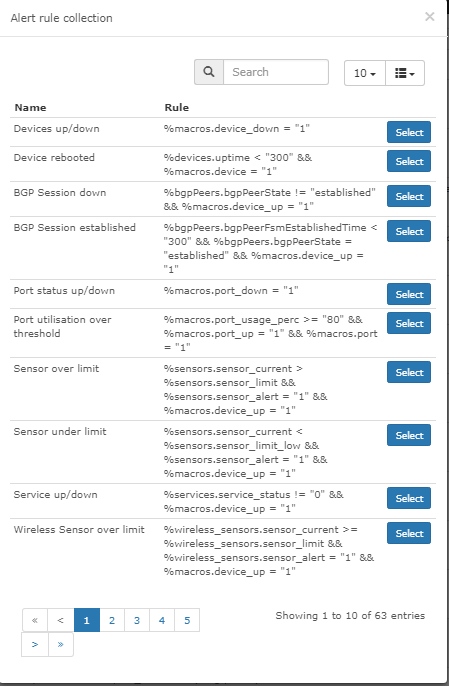

# Rules

You define rules with a logical language.

With the GUI, you can create rules easily.

To create more complex rules, which can include mathematical
calculations and MySQL queries, use [macros](Macros.md)

## Syntax

Rules must contain a minimum of 3 elements: an __Entity__, a __Condition__ and a __Value__.
Rules can contain braces and __Glues__.

__Entities__ come from the Table and Field of the database. For Example: `ports.ifOperStatus`.

__Conditions__ can be any of:

- Equals `=`
- Not Equals `!=`
- In `IN`
- Not In `NOT IN`
- Begins with `LIKE ('...%')`
- Doesn't begin with `NOT LIKE ('...%')`
- Contains `LIKE ('%...%')`
- Doesn't Contain `NOT LIKE ('%...%')`
- Ends with `LIKE ('%...')`
- Doesn't end with `NOT LIKE ('%...')`
- Between `BETWEEN`
- Not Between `NOT BETWEEN`
- Is Empty `= ''`
- Is Not Empty `!= '''`
- Is Null `IS NULL`
- Is Not Null `IS NOT NULL`
- Greater `>`
- Greater or Equal `>=`
- Less `<`
- Less or Equal `<=`
- Regex `REGEXP`

__Values__ can be an entity or other data. If you use a macro or a different column name as a value, you
must put the macro or column name in backticks. i.e. \`macros.past_60m\` or \`processors.processor_perc_warn\`.

__Note__: Regex supports MySQL Regular expressions.

Arithmetic is also permitted.

## Options

These are some of the other options available when you add an alerting rule:

- Rule name: The name of the rule.
- Severity: How "important" the rule is.
- Invert match: Invert the matching rule (ie. alert on items that
  do _not match the rule).
- Mute alerts: The system does not send the alert through the alert
  transport. But it shows the alert in the Web UI.
- Recovery alerts: If this is off, the system does not send the
  recovery notification.
- Acknowledgement alerts: If this is off, the system does not send the
  acknowledgement notifications.
- Operations: Select the alert operation that you want to attach to this alert rule.
- Match devices, groups and location list: Attach this alert rule only to these devices.
- All devices except in list: Invert the attachment to a device, from the Match selection.
- Procedure URL: [Rules.md#Procedure](See Procedure).
- Notes: Add notes about this rule. This information also goes to the alert notifications.

## Advanced

On the Advanced tab, you can specify some more options for the alert rule:

- Override SQL: Enable this if you use a custom query
- Query: The query to use for the alert.

- An example: an average rule for all CPUs above 10%

```sql
SELECT devices.*,AVG(processors.processor_usage) AS cpu_avg, processors.* FROM 
devices INNER JOIN processors ON devices.device_id 
= processors.device_id WHERE devices.device_id 
= ? AND devices.status = 1 AND devices.disabled = 
0 AND devices.ignore = 0 GROUP BY devices.device_id, 
devices.status, devices.disabled, devices.ignore 
HAVING AVG(processors.processor_usage) 
> 10;
```

!!! note
    The 10 contains the average CPU usage value. You can
    change this value to the value that you want.
    Copy this into the Alert Rule under
    Advanced. Then paste it into the Query box and set the Override SQL switch.

## Procedure

You can give a procedure URL when you create the rule. Only links
that start with "http://" are supported. Other links cause an error.
When this is configured, you can open procedures from the Alert widget
with the "Open" button. You can show or hide the button in the
widget configuration box.

## Examples

Alert when:

- Device goes down: `devices.status != 1`
- Any port changes: `ports.ifOperStatus != 'up'`
- Root-directory gets too full: `storage.storage_descr = '/' AND
  storage.storage_perc >= '75'`
- Any storage gets fuller than the 'warning': `storage.storage_perc >= storage_perc_warn`
- If device is a server and the used storage is above the warning
  level, but ignore /boot partitions: `storage.storage_perc >
  storage.storage_perc_warn AND devices.type = "server" AND
  storage.storage_descr != "/boot"`
- VMware LAG is not using "Source ip address hash" load balancing:
  `devices.os = "vmware" AND ports.ifType = "ieee8023adLag" AND
  ports.ifDescr REGEXP "Link Aggregation .*, load balancing algorithm:
  Source ip address hash"`
- Syslog, authentication failure during the last 5m:
  `syslog.timestamp >= macros.past_5m AND syslog.msg REGEXP ".*authentication failure.*"`
- High memory usage: `macros.device_up = 1 AND mempools.mempool_perc >=
 90 AND mempools.mempool_descr REGEXP "Virtual.*"`
- High CPU usage(per core usage, not overall): `macros.device_up
  = 1 AND processors.processor_usage >= 90`
- High port usage, where description is not client & ifType is not
  softwareLoopback: `macros.port_usage_perc >= 80 AND
  port.port_descr_type != "client" AND ports.ifType != "softwareLoopback"`
- A mac address is found on your network: `ipv4_mac.mac_address = "2c233a756912"`
- Device MTU test fails: `devices.mtu_status != 1`

## Alert Rules Collection

You can also select an Alert Rule from the Alerts Collection. Users in
the community submit these Alert Rules :) If you want to
submit your alert rules to the collection, submit them here [Alert Rules Collection](https://github.com/librenms/librenms/edit/master/resources/definitions/alert_rules.json)


