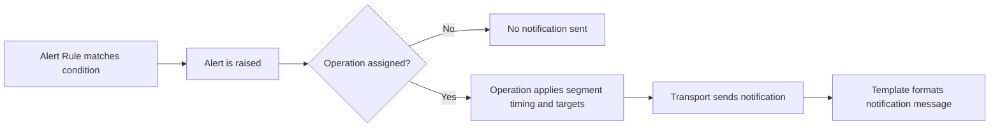

# Introduction

LibreNMS alerting contains some connected parts. This page shows what each part does and how the parts operate together.

## Alerting chart

| Part | Purpose | Required | Linked guide |
| --- | --- | --- | --- |
| Alert Rules | Set when an alert starts | Yes | [Creating alert rules](Rules.md) |
| Alert Operations | Set who gets a notification, and when | No (but necessary for notifications) | [Creating alert operations](Operations.md) |
| Alert Transports | Set how the system sends notifications (email, Slack, and so on) | No (but necessary for notifications) | [Configuring alert transports](Transports.md) |
| Alert Templates | Set the notification message format | No (optional, recommended) | [Configuring alert templates](Templates.md) |

Flow:

`Rule matches` -> `Alert is raised` -> `Operation decides timing/targets` -> `Transport sends notification` -> `Template formats message`

If a rule has no operation, LibreNMS can start the alert, but it sends no notification.

## Recommended setup order

For most users, this order is the easiest:

1. Create one or more operations (notification behavior)
2. Create alert rules (trigger conditions)
3. Attach an operation to each rule that must send notifications

[Creating alert operations](Operations.md)

Then you need an alert rule. The rule reacts to changes on your devices and starts an alert.

[Creating alert rules](Rules.md)

After that, you must also tell LibreNMS how to send you a notification
when an alert starts. You do this with `Alert Transports`.

[Configuring alert transports](Transports.md)

The next step is not mandatory, but most people find it
useful. Custom alert templates help you get the full benefit
of the alert system. We include a default
template, but the data that you receive in the alerts with it is limited.

[Configuring alert templates](Templates.md)

## Managing alerts

When an alert starts, you see it on the Alerts ->
Notifications page in the Web UI.

This list has some options. We explain
them here.

### ACK

This column shows you the status of the alert:

 This alert is active and sends
alerts. Click this icon to acknowledge the alert.

 This alert is acknowledged
until the alert clears. Click this icon to un-acknowledge the alert.

 This alert is
acknowledged until the alert becomes worse, becomes
better or changes. At that time, the system automatically removes the acknowledgement and
the alerts start again. Click this icon to un-acknowledge the alert.

### Notes

 In this column, you get access to the
acknowledge/unacknowledge notes for this alert.
