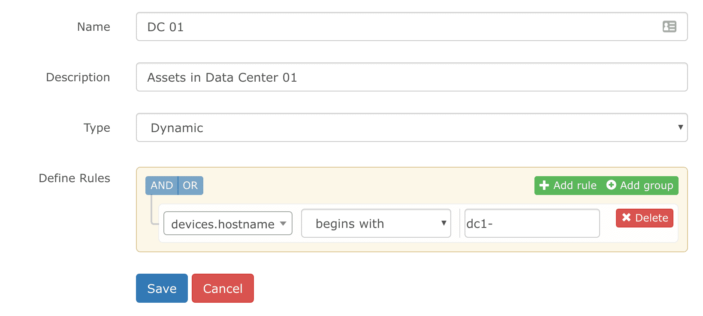

# Grouping Devices

LibreNMS can put your devices together in groups, almost the same
as you configure alerts. This document helps you
start.

## Dynamic Groups

### Rule Editor

The same as our alerting system, dynamic groups are based on the MySQL
structure of your data. They use QueryBuilder to make the SQL
queries that build your groups.

You can look around in MySQL with `show tables` to see all
the tables in LibreNMS. Then run `desc <tablename>` to
see the table structure. These two make the
basic format for the QueryBuilder interface, such as __tablename.columnname__.

To see the data in the table, you can then run
`select * from <tablename> limit 5;`. With this, you get an idea
of the data that comes back for your dynamic group.

A working example, and a usual question: you want to
group devices by hostname, and your hostname format is
dcX.[devicetype].example.com.

To group them by the device type `rtr`, add
a rule for routers: `devices.hostname` `endswith` `rtr.example.com`.
This matches dcX.`rtr.example.com`

To group them by DC, you can use the rule
`devices.hostname` regex `dc1\..*\.example\.com` (Do not forget to
escape periods in the regex). This matches `dc1.rtr.example.com`.

## Static Groups

You can create static groups (and convert dynamic groups to static) to
put specified devices in a group. Select static as the type, and
select the devices that you want in the group.

You can now select this group from the Devices -> All Devices link in
the navigation at the top. You can also map your device groups to
an alert rule, in the section `Match devices, groups and locations list`
of each alert rule.