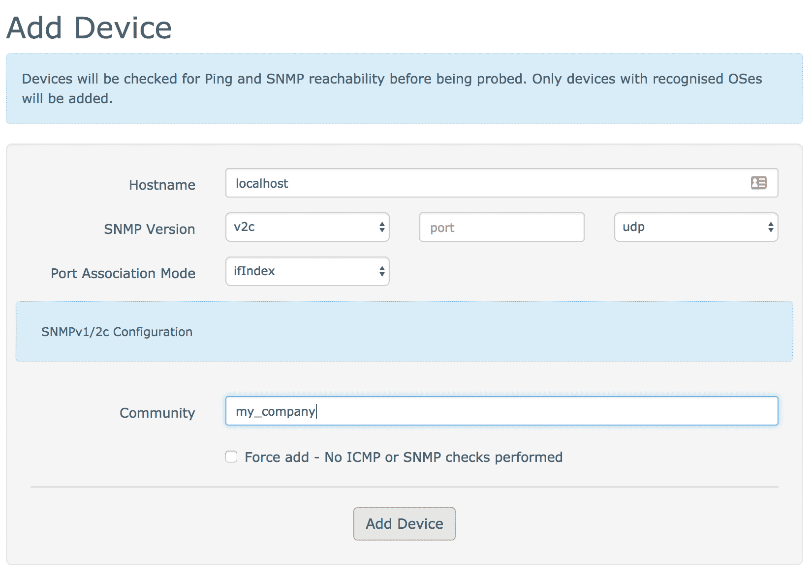
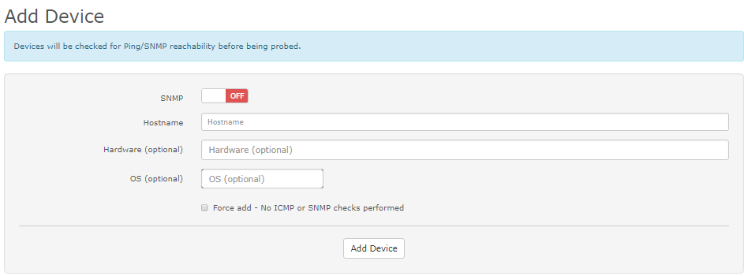

# Adding Device

There are two methods to add a new device into LibreNMS. You can
add a device with the [WebUI](Adding-a-Device.md#via-webui) or with the [CLI](Adding-a-Device.md#via-cli).

## Via WebUI

In the web interface, go to Devices in the menu and click Add Device.
Enter the necessary details for the device that you want to add. Then
click 'Add Host'. As an example, if your device is configured to
use the community `my_company` with snmp `v2c`, enter the
data as shown in the screenshot:



The default SNMP Port is 161.

By default, the system uses the Hostname to poll data. If you want
to poll data through a specified IP-Address (for example, a Management IP), set the 
Hostname to the IP-Address. After the device is added, you can edit
the device and set the display name to the initial Hostname.


## Via CLI

On the command line, through ssh as the `librenms` user, you can add a
new device. Change to the directory of your LibreNMS installation and
type the command below (make sure that you enter the correct details).

```bash
./lnms device:add --v2c -c yourSNMPcommunity yourhostname
```

You can use `./lnms device:add --help` for a list of the available options and the default values.

As an example, if your device has the name `mydevice.example.com`, and it is
configured to use the community `my_company` with snmp `v2c`,
enter:

```bash
./lnms device:add --v2c -c my_company mydevice.example.com
```

!!! note
    If the community contains special characters, such
    as `$`, you must put it in `'`. That is, `'Pa$$w0rd'`.

## Ping Only Device

You can add ping only devices into LibreNMS through the WebUI or the CLI. When
you add the device, set the SNMP button to "off". The system adds the
device into LibreNMS as a Ping Only Device and shows an ICMP Response Graph.

- Hostname: IP address or DNS name.
- Hardware: Optional. You can type what you want.
- OS: Optional. This adds the OS icon of the device.

Through the CLI, use:

```bash
./lnms device:add --ping-only yourhostname
```



A How-to video is here: [How to add ping only devices](https://youtu.be/cjuByubg-uk)

## Automatic Discovery and API

If you want to add devices automatically, read the
[Auto-discovery Setup](../Extensions/Auto-Discovery.md) guide.

If you want to add devices programmatically, refer to
our [API documentation](../API/index.md)
