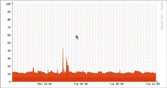

# Configuration Docs

## Configuration location

Configuration is stored in one of two places:

- Database: This applies to all pollers. You can set it with
`lnms config:set <setting> <value>` or in the Web UI. Database config
has priority over `config.php` and is the recommended option.

- `config.php`: This applies only to the local poller. Configs that you set here
become disabled in the Web UI. This prevents unwanted behaviour.

## Configuration format

For configuration in the database, LibreNMS uses dot notation for config
items. In `config.php`, the configuration is a php array under `$config`.
This example uses some snmp configuration:

=== "Database"
    `snmp.community`

    `snmp.community.+`

    `snmp.v3.0.authalgo`

=== "config.php"
    `$config['snmp']['community']`

    `$config['snmp']['community'][]`

    `$config['snmp']['v3'][0]['authalgo']`

## CLI
`lnms config:get <setting>` gets the current config settings (a combination of database, config.php, and defaults).  
`lnms config:set <setting> <value>` sets the config setting in the database.
If you run `lnms config:set <setting>` with no value, the command asks you if you want
to set the setting back to its default.

Parameters are:
```
    <setting>   dot notation of config item
                trailing .+ instructs to append <value> to existing value

    <value>     JSON formatted config value
                string, number, true and false are all valid JSON value
```

If you set up bash completion, you can use tab completion to find config settings.

!!! note
    Not all documentation shows the `lnms config:set` method to
    set configuration items. But the method operates correctly, and it is the recommended option, not `config.php`.

    Not all configuration settings are defined in LibreNMS. You can 
    set them with the `--ignore-checks` option. Without that option, the command makes sure that 
    the input is valid. Be careful: with `--ignore-checks`, you can enter bad values. 

    Please report missing settings.

### Getting a list of all current values

To get a full list of all the current values, use the command `lnms config:get --dump`.
To make the output easier to read, you can use the `jq` package:
`lnms config:get --dump | jq`.

Example output:

```bash
lnms config:get --dump | jq 
{
  "install_dir": "/opt/librenms",
  "active_directory": {
    "users_purge": 0
  },
  "addhost_alwayscheckip": false,
  "alert": {
    "ack_until_clear": false,
    "admins": true,
    "default_copy": true,
    "default_if_none": false,
    "default_mail": false,
    "default_only": true,
    "disable": false,
    "fixed-contacts": true,
    "globals": true,
    "syscontact": true,
    "transports": {
      "mail": 5
    },
    "tolerance_window": 5,
    "users": false,
    ...
```

### Examples

These examples help you start:

```bash
lnms config:get snmp.community
  [
      "public"
  ]

lnms config:set snmp.community.+ testing

lnms config:get snmp.community
  [
      "public",
      "testing"
  ]


lnms config:set snmp.community.0 private

lnms config:get snmp.community
  [
      "private",
      "testing"
  ]

lnms config:set snmp.community test
  Invalid format

lnms config:set snmp.community '["test", "othercommunity"]'

lnms config:get snmp.community
  [
      "test",
      "othercommunity"
  ]

lnms config:set snmp.community

  Reset snmp.community to the default? (yes/no) [no]:
  > yes


lnms config:get snmp.community
  [
      "public"
  ]
```

You can collapse the multi-line configuration items above into a single line with `| jq -c`. This helps with set commands. For example:

```bash
lnms config:get snmp.community | jq -c
["public","testing"]
```

As an alternative, you can keep multi-line items exactly as `lnms config:get` returns them, for easier reading. Use this format:
```bash
lnms config:set snmp.community \
'
[
    "public",
    "testing"
]
'
```

## Pre-load configuration

This feature is primarily for docker images and other automation.
When you install LibreNMS for the first time with a new database, you can put yaml key value files
in `database/seeders/config` to fill the config database before the start.

Example snmp.yaml:

```yaml
snmp.community:
    - public
    - private
snmp.max_repeaters: 30
```

!!! danger
    The example above uses the correct, flattened notation. Do **NOT** create a
    block for `snmp` with sub-keys `community` and `max_repeaters`. If you do, the system
    overwrites the whole `snmp` block and replaces it with only those two sub-keys.  The config keys in your `seeders` file
    must be the same as those in `resources/definitions/config_definitions.json`.

## Directories

```bash
lnms config:set temp_dir /tmp
```

The temporary directory is the location where the system creates
images and other temporary files on your filesystem.

```bash
lnms config:set log_dir /opt/librenms/logs
```

LibreNMS keeps its log files in this directory.

## Database config

Set these variables either in .env (/opt/librenms/.env by default) or in the environment.

```dotenv
DB_HOST=127.0.0.1
DB_DATABASE=librenms
DB_USERNAME=DBUSER
DB_PASSWORD="DBPASS"
```

Use non-standard port:

```dotenv
DB_PORT=3306
```

Use a unix socket:

```dotenv
DB_SOCKET=/run/mysqld/mysqld.sock
```

## Core

### PHP Settings

You can change the memory limits for php in LibreNMS. The
value is in Megabytes and must be an integer value:

`lnms config:set php_memory_limit 128`

### Programs

Many of these have clear names. Thus, no more information is
given. For extensions that have their own documentation page, we
give a link, not the config.

#### RRDTool

You can now configure these options in the WebUI:

!!! setting "external/binaries"
    ```bash
    lnms config:set rrdtool /usr/bin/rrdtool
    ```

Refer to [1 Minute polling](1-Minute-Polling.md) for information on
how to record data more frequently.

#### fping

!!! setting "external/binaries"
    ```bash
    lnms config:set fping /usr/bin/fping
    lnms config:set fping6 fping6
    ```

!!! setting "poller/ping"
    ```bash
    lnms config:set fping_options.timeout 500
    lnms config:set fping_options.count 3
    lnms config:set fping_options.interval 500
    lnms config:set fping_options.tos 184
    ```

`fping` configuration options:

* `timeout` (`fping` parameter `-t`): The time that fping waits
  for a reply to its first request (in milliseconds). **See the note
  below**
* `count` (`fping` parameter `-c`): The number of request packets to send
  to each target.
* `interval` (`fping` parameter `-p`): The time in milliseconds that fping
  waits between packets to one target.
* `tos` (`fping`parameter `-O`): Set the type of service flag (TOS). The value can be in decimal or hexadecimal (0xh) format. You can use this to make sure that QOS mechanisms in the network put the ping packets in the correct queue. A table is available on the [TOS Wikipedia page](https://en.wikipedia.org/wiki/Type_of_service).

!!! note
    A timeout value that is more than the interval value can
    make the poller slower. Example:

    timeout: 3000

    count: 3

    interval: 500

    In this example, the timeout value of 3000 (3 seconds) replaces
    the interval. Because we send three icmp packets (count:
    3), each packet is delayed by 3 seconds. Thus, fping
    takes > 6 seconds to return results.

The fping / icmp check finds if a device is up. You can disable this
check globally or for each device. **We do not recommend that you
disable the fping / icmp check, unless you know the effect. In the
worst condition, if a large number of devices are down, it is possible
that the poller does not complete in 5 minutes, because it waits for
snmp timeouts.**

Globally disable fping / icmp check:

!!! setting "poller/ping"
    ```bash
    lnms config:set icmp_check false
    ```

To do this for one device, go to
Device -> Edit -> Misc -> Disable ICMP Test? On

#### SNMP

SNMP program locations.

!!! setting "external/binaries"
    ```bash
    lnms config:set snmpwalk /usr/bin/snmpwalk
    lnms config:set snmpget /usr/bin/snmpget
    lnms config:set snmpbulkwalk /usr/bin/snmpbulkwalk
    lnms config:set snmpgetnext /usr/bin/snmpgetnext
    lnms config:set snmptranslate /usr/bin/snmptranslate
    ```

#### Misc binaries
!!! setting "external/binaries"
    ```bash
    lnms config:set whois /usr/bin/whois
    lnms config:set ping /bin/ping
    lnms config:set mtr /usr/bin/mtr
    lnms config:set nmap /usr/bin/nmap
    lnms config:set nagios_plugins /usr/lib/nagios/plugins
    lnms config:set ipmitool /usr/bin/ipmitool
    lnms config:set virsh /usr/bin/virsh
    ```

## Authentication

General Authentication settings.

The minimum password length for auth types that permit user creation

!!! setting "auth/general"
    ```bash
    lnms config:set password.min_length 8
    ```

## Proxy support

For alerting and the callback function, you can use an
http proxy setting. This can be one of these:

!!! setting "system/proxy"
    ```bash
    lnms config:set callback_proxy proxy.domain.com
    lnms config:set http_proxy proxy.domain.com
    ```

You can also use one of these environment variables, which you can set in `/etc/environment`:

```bash
http_proxy=proxy.domain.com
https_proxy=proxy.domain.com
```

## RRDCached

Refer to [RRDCached](../Extensions/RRDCached.md)

## WebUI Settings

!!! setting "system/server"
    ```bash
    lnms config:set base_url http://demo.librenms.org
    ```

LibreNMS tries to find the URL that you use. But you can set it here.

!!! setting "webui/style"
    ```bash
    lnms config:set site_style light
    ```

There are a number of styles that change the navigation bar. The
styles are device, blue, dark, light and mono. The default is light.

You can replace many visual elements. Create your
own css stylesheet and refer to it here. Put custom css files
into  `html/css/custom`. Then auto updates ignore them. You
can specify as many css files as you want. The browser loads them
in the order in which they are in your config.

!!! setting "webui/style"
    ```bash
    lnms config:set webui.custom_css.+ css/custom/styles.css
    ```

You can replace the default logo with your logo. Put custom image
files into `html/images/custom`. Then auto updates ignore them.

!!! setting "webui/style"
    ```bash
    lnms config:set title_image images/custom/yourlogo.png
    ```

Set the page refresh interval in seconds. The default is 5
minutes. By design, some pages do not refresh.

!!! setting "webui/general"
    ```bash
    lnms config:set page_refresh 300
    ```

To create your own front page, add a blade file in `resources/views/overview/custom/`
and set `front_page` to its name.
For example, if you create `resources/views/overview/custom/foobar.blade.php`, set `front_page` to `foobar`.

!!! setting "webui/front-page"
```bash
lnms config:set front_page default
```

Set a global default dashboard page for each user who did not set one in their user
preferences.  Set it to the dashboard_id of a dashboard that is Shared,
Shared(read) or Shared (Admin RW). If you do not, the system automatically creates
an empty dashboard called `Default` for each user at their first login.

!!! setting "webui/dashboard"
    ```bash
    lnms config:set webui.default_dashboard_id 0
    ```

This is the default message that the login page shows to users.

!!! setting "auth/general"
    ```bash
    lnms config:set login_message "Unauthorised access or use shall render the user liable to criminal and/or civil prosecution."
    ```

If this is set to true, the login page shows an overview of the devices and their status.

!!! setting "auth/general"
    ```bash
    lnms config:set public_status true
    ```

Enable / disable some menus in the WebUI.

!!! setting "webui/menu"
    ```bash
    lnms config:set show_locations true  # Enable Locations on menu
    lnms config:set show_locations_dropdown true  # Enable Locations dropdown on menu
    lnms config:set show_services false  # Disable Services on menu
    lnms config:set int_customers true  # Enable Customer Port Parsing
    lnms config:set int_transit true  # Enable Transit Types
    lnms config:set int_peering true  # Enable Peering Types
    lnms config:set int_core true  # Enable Core Port Types
    lnms config:set int_l2tp false  # Disable L2TP Port Types
    ```

!!! setting "webui/dashboard"
    ```bash
    lnms config:set summary_errors false  # Show Errored ports in summary boxes on the dashboard
    ```

!!! setting "webui/port-descr"
    lnms config:set customers_descr '["cust"]'  # The description to look for in ifDescr. Can have multiple '["cust","cid"]'
    lnms config:set transit_descr '["transit"]'  # Add custom transit descriptions (array)
    lnms config:set peering_descr '["peering"]'  # Add custom peering descriptions (array)
    lnms config:set core_descr '["core"]'  # Add custom core descriptions  (array)
    lnms config:set custom_descr '["This is Custom"]'  # Add custom interface descriptions (array)
    ```

You can adjust the number and the time frames of the quick select
time options for graphs, and the mini graphs shown in each row.

Quick select:

```bash
lnms config:set graphs.mini.normal '{
    "day": "24 Hours",
    "week": "One Week",
    "month": "One Month",
    "year": "One Year"
}'

lnms config:set graphs.mini.widescreen '{
    "sixhour": "6 Hours",
    "day": "24 Hours",
    "twoday": "48 Hours",
    "week": "One Week",
    "twoweek": "Two Weeks",
    "month": "One Month",
    "twomonth": "Two Months",
    "year": "One Year",
    "twoyear": "Two Years"
}'
```

Mini graphs:

```bash
lnms config:set graphs.row.normal '{
    "sixhour": "6 Hours",
    "day": "24 Hours",
    "twoday": "48 Hours",
    "week": "One Week",
    "twoweek": "Two Weeks",
    "month": "One Month",
    "twomonth": "Two Months",
    "year": "One Year",
    "twoyear": "Two Years"
}'
```

To disable the mouseover popover for mini graphs, set this to false.

!!! setting "webui/general"
    ```bash
    lnms config:set web_mouseover true
    ```

To disable image lazy loading, set this to false.

!!! setting "webui/general"
    ```bash
    lnms config:set enable_lazy_load true
    ```

Enable or disable the sysDescr output for a device.

!!! setting "webui/general"
    ```bash
    lnms config:set overview_show_sysDescr true
    ```

This is a simple template that controls the default display of device names.
You can change this setting for each device. Edit the device in the WebUI.

You can enter free text, which includes one or more of these template replacements:

| Template                    | Replacement                                                          |
|-----------------------------|----------------------------------------------------------------------|
| `{{ $hostname }}`           | The hostname or IP of the device that was set when added  *default   |
| `{{ $sysName_fallback }}`   | The hostname or sysName if hostname is an IP                         |
| `{{ $sysName }}`            | The SNMP sysName of the device, falls back to hostname/IP if missing |
| `{{ $ip }}`                 | The actual polled IP of the device, will not display a hostname      |

For example, `{{ $sysName_fallback }} ({{ $ip }})` shows text such as `server (192.168.1.1)`

!!! setting "webui/device"
    ```bash
    lnms config:set device_display_default '{{ $hostname }}'
    ```

Interface types that are not shown in graphs in the WebUI. The default array
contains more items. Refer to resources/definitions/config_definitions.json for the full list.

!!! setting "webui/graph"
    ```bash
    lnms config:set device_traffic_iftype.+ '/loopback/'
    ```

Administrators can clear the last discovered time of a device.
This causes a full discovery run in the configured time window.

!!! setting "webui/device"
    ```bash
    lnms config:set enable_clear_discovery true
    ```

Show the `X`th percentile in the graph instead of the default 95th percentile.

!!! setting "webui/graph"
    ```bash
    lnms config:set percentile_value 90
    ```

The target maximum hostname length for the shorthost() function.
You can increase this if you want to fit more of the hostname in graph titles.
The default value is 12. But a very long value can possibly break
graph generation.

!!! setting "webui/graph"
    ```bash
    lnms config:set shorthost_target_length 15
    ```

You can enable dynamic graphs. With them, you can easily zoom in/out
and move through the timeline of the graphs.

!!! setting "webui/graph"
    ```bash
    lnms config:set webui.dynamic_graphs true
    ```

You can move and scale graphs without a page reload:


## Availability Thresholds

These thresholds set when different screens show ok/warning/error.
This includes the device 90 day availability widget

- **Green**: availability >= availablity.threshold_ok (default: 99.9%)
- **Orange**: availability >= availablity.threshold_warning (default: 95%)
- **Red**: availability < availablity.threshold_warning

!!! setting "webui/device"
    ```bash
    lnms config:set availablity.threshold_ok 99.99
    lnms config:set availablity.threshold_warning 95
    ```

## Stacked Graphs

You can enable stacked graphs instead of the default inverted
graphs.

!!! setting "webui/graph"
    ```bash
    lnms config:set webui.graph_stacked true
    ```

## Add host settings

The setting below controls how hosts are added.  If you add a host
as an ip address, the system makes sure that the ip is not already
present. If the ip is present, the system does not add the host. If you
add the host by hostname, this check does not occur.  If the setting is
true, the system resolves hostnames and also does the check.  This helps
prevent accidental duplicate hosts.

!!! setting "discovery/general"
    ```bash
    lnms config:set addhost_alwayscheckip false # true - check for duplicate ips even when adding host by name.
                                                # false- only check when adding host by ip.
    ```

By default, you can add hosts with duplicate sysName's. You
can disable this with this config:

!!! setting "discovery/general"
```bash
lnms config:set allow_duplicate_sysName false
```

## Global poller and discovery modules

Enable or disable discovery or poller modules.

This setting has an order of priority. Device settings replace
per OS settings, which replace Global settings. (Device -> OS -> Global).

Thus, if the module is set at a more specific level, that level replaces the
less specific settings.

Global:

!!! setting "discovery/discovery_modules"
    ```bash
    lnms config:set discovery_modules.arp-table false
    lnms config:set discovery_modules.entity-state true
    ```

!!! setting "poller/poller_modules"
    ```bash
    lnms config:set poller_modules.entity-state true
    ```

Per OS:

```bash
lnms config:set os.ios.discovery_modules.arp-table false
lnms config:set os.ios.discovery_modules.entity-state true

lnms config:set os.ios.poller_modules.entity-state true
```

## SNMP Settings

Default SNMP options, which include retry and timeout settings, and
also the default version and port.

!!! setting "poller/snmp"
    ```bash
    lnms config:set snmp.timeout 1                         # timeout in seconds
    lnms config:set snmp.retries 5                         # how many times to retry the query
    lnms config:set snmp.transports '["udp", "udp6", "tcp", "tcp6"]'    # Transports to use
    lnms config:set snmp.version '["v2c", "v3", "v1"]'       # Default versions to use
    lnms config:set snmp.port 161                          # Default port
    lnms config:set snmp.exec_timeout 1200                 # execution time limit in seconds
    ```

> NOTE: `timeout` is the time to wait for an answer and `exec_timeout`
> is the maximum time to run a query.

The default v1/v2c snmp community to use. You can make this array
larger with `[1]`, `[2]`, `[3]`, etc.

!!! setting "poller/snmp"
    ```bash
    lnms config:set snmp.community.0 public
    ```

!!! note
    The system uses this list of SNMP communities for auto discovery,
    if enabled, and as a default set for each manually added device.

The default v3 snmp details to use. You can make this array larger with
`[1]`, `[2]`, `[3]`, etc.

!!! setting "poller/snmp"
    ```bash
    lnms config:set snmp.v3.0 '{
        authlevel: "noAuthNoPriv",
        authname: "root",
        authpass: "",
        authalgo: "MD5",
        cryptopass: "",
        cryptoalgo: "AES"
    }'
    ```

```
authlevel   noAuthNoPriv | authNoPriv | authPriv
authname    User Name (required even for noAuthNoPriv)
authpass    Auth Passphrase
authalgo    MD5 | SHA | SHA-224 | SHA-256 | SHA-384 | SHA-512
cryptopass  Privacy (Encryption) Passphrase
cryptoalgo  AES | AES-192 | AES-256 | AES-256-C | DES
```

## MTU Settings

LibreNMS can do optional tests for MTU problems.  The current implementation operates only for devices with
pings enabled. You must also set this configuration setting to enable the MTU check:

!!! setting "poller/mtu"
    ```bash
    lnms config:set mtu_options.bytes 1500
    ```

To disable the MTU test, set the packet size to null (the default).

The MTU check does not make sure that packets can go through the network without fragmentation.  The test makes
sure that 2 way communication can occur, also if packets must be fragmented at a point along the path.

## Auto discovery settings

Refer to [Auto-Discovery](../Extensions/Auto-Discovery.md)


## SSL Certificates

!!! note
    This feature is disabled by default.

LibreNMS can discover and monitor the SSL/TLS certificates that your devices show (for example, HTTPS on port 443). This helps you monitor expiry dates and receive alerts before certificates expire.

**Using the feature:** In the Web UI, open Overview -> Tools -> SSL Certificates to see the discovered certificates, add entries manually (host and port), stop or enable monitoring for a certificate, and remove entries. An alert rule **Expiring SSL Certificates** is available. It sends an alert when a certificate expires in less than 14 days.

**Behaviour:**

- **Discovery:** A scheduled maintenance job (`lnms maintenance:discover-ssl-certificates`) runs each day and connects to each active device on port 443 (HTTPS). If the device shows a certificate, the system keeps it or updates it. You can also run discovery manually for all devices or for one device.
- **Refresh:** A separate scheduled job (`lnms maintenance:refresh-ssl-certificates`) runs each day. It checks the known certificates again and updates the expiry and other details. You can refresh all enabled certificates, or one certificate by ID.

**Configuration options:** You can set these in the Web UI or with the CLI (`lnms config:set`).

| Option | Type | Default | Description |
|--------|------|---------|-------------|
| `ssl_certificates.auto_discover` | boolean | `false` | When enabled, the scheduled SSL discovery job runs each day. Set to `false` to disable automatic discovery (for example, if you add certificates only manually). |
| `ssl_certificates.skip_hosts` | array (strings) | `[]` | List of hostnames or IPs that discovery and refresh ignore. Matching is not case-sensitive. Use this for devices or hosts that must not receive SSL probes (for example, load balancers that show different certs, or hosts that block or limit connections). |

!!! setting "system/ssl-certificates"
    ```bash
    # Enable automatic SSL discovery
    lnms config:set ssl_certificates.auto_discover true

    # Skip discovery and refresh for specific hosts (add one per line)
    lnms config:set ssl_certificates.skip_hosts.+ internal-lb.example.com
    lnms config:set ssl_certificates.skip_hosts.+ 192.168.1.1
    ```

To set the whole array at once:

!!! setting "system/ssl-certificates"
    ```bash
    lnms config:set ssl_certificates.skip_hosts '["host1.example.com", "host2.example.com"]'
    ```

## Email configuration

!!! setting "alerting/email"
    ```bash
    lnms config:set email_backend mail
    lnms config:set email_from librenms@yourdomain.local
    lnms config:set email_user `lnms config:get project_id`
    lnms config:set email_sendmail_path /usr/sbin/sendmail
    lnms config:set email_smtp_host localhost
    lnms config:set email_smtp_port 25
    lnms config:set email_smtp_timeout 10
    lnms config:set email_smtp_secure tls
    lnms config:set email_smtp_auth false
    lnms config:set email_smtp_username NULL
    lnms config:set email_smtp_password NULL
    ```

The type of mail transport to use for emails. The permitted
options for `email_backend` are mail, sendmail or smtp. The other
options give support for the different transports.

For security reasons, the SMTP server connection through TLS tries to make sure that the certificate is valid. If you must disable verification, you can use the email_smtp_verifypeer option (true by default) and email_smtp_allowselfsigned (false by default).

!!! setting "alerting/email"
    ```bash
        lnms config:set email_smtp_verifypeer false
        lnms config:set email_smtp_allowselfsigned true
    ```

## Alerting

Refer to [Alerting](../Alerting/index.md)

## Billing

Refer to [Billing](../Extensions/Billing-Module.md)

## Global module support

!!! setting "webui/menu"
    ```bash
    lnms config:set enable_syslog false # Enable Syslog
    lnms config:set enable_inventory true # Enable Inventory
    lnms config:set enable_pseudowires true # Enable Pseudowires
    ```

```bash
lnms config:set enable_vrfs true # Enable VRFs
```

## Port extensions

Refer to [Port-Description-Parser](../Extensions/Interface-Description-Parsing.md)

Enable / disable additional port statistics.

```bash
lnms config:set enable_ports_etherlike false
lnms config:set enable_ports_junoseatmvp false
lnms config:set enable_ports_poe false
```

## Port Group

Assign a new discovered Port automatically to Port Group with this Port Group ID
(0 means no Port Group assignment)

!!! setting "discovery/ports"
    ```bash
    lnms config:set default_port_group 0
    ```

## External integration

### Rancid

Rancid configuration. `rancid_configs` is an array that contains all
the locations of your rancid files. If you set `rancid_ignorecomments`,
the system does not show lines that start with #

!!! setting "external/rancid"
    ```bash
    lnms config:set rancid_configs.+ /var/lib/rancid/network/configs/
    lnms config:set rancid_repo_type svn
    lnms config:set rancid_ignorecomments false
    ```

If the rancid repository is a bare Git repository, it must be in a
directory with a name that ends in `.git`. You can then combine the path to
that repository with an added path to the rancid files in Git

!!! setting "external/rancid"
    ```bash
    lnms config:set rancid_configs.+ /var/lib/rancid/git/rancid.git/configs/
    lnms config:set rancid_repo_type git-bare
    lnms config:set rancid_repo_url /rancid
    lnms config:set rancid_ignorecomments false
    ```

You must set one more parameter, `rancid_repo_url`, to the URL of GitWeb
or a similar tool that shows the bare Git repository.

### Oxidized

Refer to [Oxidized](../Extensions/Oxidized.md)

### CollectD

Specify the location of the collectd rrd files. The location
in LibreNMS must be the same as the location set in
/etc/collectd.conf and etc/collectd.d/rrdtool.conf

!!! setting "external/collectd"
    ```bash
    lnms config:set collectd_dir /var/lib/collectd/rrd
    ```

`/etc/collectd.conf`
```bash
<Plugin rrdtool>
        DataDir "/var/lib/collectd/rrd"
        CreateFilesAsync false
        CacheTimeout 120
        CacheFlush   900
        WritesPerSecond 50
</Plugin>
```

`/etc/collectd.d/rrdtool.conf`
```bash
LoadPlugin rrdtool
<Plugin rrdtool>
       DataDir "/var/lib/collectd/rrd"
       CacheTimeout 120
       CacheFlush   900
</Plugin>
```

Specify the location of the collectd unix socket. With a socket,
the system writes the collectd graphs to disk before it draws
them. Make sure that your web server has permission to write to this socket.

!!! setting "external/collectd"
    ```bash
    lnms config:set collectd_sock unix:///var/run/collectd.sock
    ```

### Smokeping

Refer to [Smokeping](../Extensions/Smokeping.md)

### NFSen

Refer to [NFSen](../Extensions/NFSen.md)

### Location parsing

LibreNMS can read sysLocation information and map the device location from GeoCoordinates or GeoCoding information.

- Info-keywords
  - `[]` contains optional Latitude and Longitude information, if you want manual GeoCoordinate positioning.
  - `()` contains optional information that GeoCoding lookups ignore.


#### GeoCoordinates

If the device sysLocation information contains [lat, lng] (note the comma and the square brackets), the system uses this to find the GeoCoordinates.

Example:
```bash
name_that_can_not_be_looked_up [40.424521, -86.912755]
```

The system then sets the coordinates to 40.424521 latitude and -86.912755 longitude.

#### GeoCoding

Then the system tries to look up the sysLocation with a map engine, if you configured one under
`lnms config:get geoloc.engine`. The information must be accurate, or no result comes back. The
lookup ignores information in parentheses. Thus, you can add details that would
cause problems for the lookup.

Example:
```bash
1100 Congress Ave, Austin, TX 78701 (3rd floor)
Geocoding lookup is:
1100 Congress Ave, Austin, TX 78701
```

#### Overrides

1. You can overwrite a devices sysLocation in the WebGui     under "Device settings" for that device.
2. You can set the location coordinates for a location in the WebGui under Device > Geo Locations -> All Location.

### Location mapping

If you only want to set GPS coordinates on a location, go to
Devices > Geo Locations > All Locations and edit the coordinates
there.

But you can replace the sysLocation value that comes back for one device or many devices.

For example, you have 100 devices that all contain the sysLocation value `Under the Sink`, which
is not the real address. You do not have to edit each device manually. You can specify a mapping that replaces the sysLocation
value.

Exact Matching:

`Under the Sink` becomes `Under The Sink, The Office, London, UK`

!!! setting "webui/device"
    ```bash
    lnms config:set location_map '{"Under the Sink": "Under The Sink, The Office, London, UK"}'
    ```

Regex Matching:

`Not Under the Sink` becomes `Not Under The Sink, The Office, London, UK`

!!! setting "webui/device"
    ```bash
    lnms config:set location_map_regex '{"/Sink/": "Not Under The Sink, The Office, London, UK"}'
    ```

Regex Match Substitution:

`Rack10,Rm-314,Sink` becomes `Rack10,Rm-314,Under The Sink, The Office, London, UK [lat, lng]`

!!! setting "webui/device"
    ```bash
    lnms config:set location_map_regex_sub '{"/Sink/": "Under The Sink, The Office, London, UK [lat, long]"}'
    ```

The above are examples. They rewrite device snmp locations. Thus, you do not
have to configure the full location in snmp.

## Interfaces to be ignored

Discovery can ignore interfaces automatically. To do this, change
the applicable configuration options, unset default options and adjust
them, or create an OS specific option. The recommended method to ignore
interfaces is an OS specific option. The default options are
in resources/definitions/config_definitions.json. The default OS specific
definitions are in `resources/definitions/os_detection/\_specific_os_.yaml`
and can contain bad_if\* options. But change them only through a pull-request,
because local changes to the definition files block updates:

Examples:

#### Add entries to default option

!!! setting "discovery/ports"
    ```bash
    lnms config:set bad_if.+ voip-null
    lnms config:set bad_iftype.+ voiceEncap
    lnms config:set bad_if_regexp.+ '/^lo[0-9].*/'    # loopback
    ```

#### Override default bad_if values

!!! setting "discovery/ports"
    ```bash
    lnms config:set bad_if '["voip-null", "voiceEncap", "voiceFXO"]'
    ```

#### Create an OS specific array

!!! setting "discovery/ports"
    ```bash
    lnms config:set os.iosxe.bad_iftype.+ macSecControlledIF
    lnms config:set os.iosxe.bad_iftype.+ macSecUncontrolledIF
    ```

#### Various bad_if\* selection options available

`bad_if` is compared with the ifDescr value.

`bad_iftype` is compared with the ifType value.

`bad_if_regexp` is compared with the ifDescr value as a regular expression.

`bad_ifname_regexp` is compared with the ifName value as a regular expression.

`bad_ifalias_regexp` is compared with the ifAlias value as a regular expression.

## Interfaces that shouldn't be ignored

You can also put ports on an allowlist, so that they are not ignored. You can
configure `good_if` globally and per-os, the same as `bad_if`.

As an example, `bad_if_regexp` is set to ignore `Ethernet` ports.
But we want to keep the `FastEthernet` ports, and no others.
We can add a `good_if` option to permit `FastEthernet`:

!!! setting "discovery/ports"
    ```bash
    lnms config:set good_if.+ FastEthernet
    lnms config:set os.ios.good_if.+ FastEthernet
    ```

`good_if` is compared with the ifDescr value. This can also be a bad_if
value. Then the port is not ignored. i.e. if bad_if
and good_if both contain FastEthernet, ports with this value in
the ifDescr are valid.

## Interfaces to be rewritten

You can rewrite the interface label automatically with these
options.

The system replaces entries in `rewrite_if` fully.
Entries in `rewrite_if_regexp` replace only the match.
The comparison is not case-sensitive.

!!! setting "discovery/ports"
    ```bash
    lnms config:set rewrite_if '{"cpu": "Management Interface"}'
    lnms config:set rewrite_if_regexp '{"/cpu /": "Management "}'
    ```

## VLANs to ignore

Some devices report VLANs that are not applicable or are system-reserved.
With this, you can ignore specified VLAN IDs for each OS.

As an example, you want to ignore these VLAN IDs on Cisco IOS:

```text
VLAN 1002 (fddi-default)
VLAN 1003 (token-ring-default)
VLAN 1004 (fddinet-default)
VLAN 1005 (trnet-default)
```

!!! setting "discovery/vlans"
    ```bash
    lnms config:set os.ios.ignore_vlans '[1002, 1003, 1004, 1005]'
    ```

## Entity sensors to be ignored

Some devices register incorrect sensors. SNMP returns them, but
they do not exist, or they do not return data. With this, you can
ignore those sensors, from the descr field in the database. You can
ignore them globally or for each os (recommended).

As an example, you have some sensors that contain the descriptions
below:

```text
Physical id 1
Physical id 2
...
Physical id 4
```

!!! setting "discovery/sensors"
    ```bash
    lnms config:set bad_entity_sensor_regex.+ '/Physical id [0-9]+/'
    lnms config:set os.ios.bad_entity_sensor_regex '["/Physical id [0-9]+/"]'
    ```

## Entity sensors limit values

Vendors can give limit values (or thresholds) for the discovered
sensors. By default, when there is no such value, or when LibreNMS does
not have support for those limits, the system estimates the high and low
limit values from the value measured at the initial discovery.

If you prefer no high and/or low limit values when the vendor does
not give them, you can disable the estimate method:

!!! settings "discovery/sensors"
    ```bash
    lnms config:set sensors.guess_limits false
    ```

## Ignoring Health Sensors

You can remove some sensors in the configuration:

### Ignore all temperature sensors

!!! settings "discovery/sensors"
    ```bash
    lnms config:set disabled_sensors.temperature true
    ```

### Filter all sensors matching regexp ```'/PEM Iout/'```.

!!! settings "discovery/sensors"
    ```bash
    lnms config:set disabled_sensors_regex.+ '/PEM Iout/'
    ```

### Filter all 'current' sensors for Operating System 'vrp'.

```bash
lnms config:set os.vrp.disabled_sensors.current true
```

### Filter all sensors matching regexp ```'/PEM Iout/'``` for Operating System iosxe.

```bash
lnms config:set os.iosxe.disabled_sensors_regex '/PEM Iout/'
```

## Processor configuration

Custom processor warning percentage. The system sets this when it
discovers processor information.

!!! setting "discovery/processor"
    ```bash
    lnms config:set processor.default_perc_warn 75
    ```

## Storage configuration

Storage / mount points to ignore in discovery and polling.

!!! setting "discovery/storage"
    ```bash
    lnms config:set ignore_mount_removable true
    lnms config:set ignore_mount_network true
    lnms config:set ignore_mount_optical true

    lnms config:set ignore_mount.+ /kern
    lnms config:set ignore_mount.+ /mnt/cdrom
    lnms config:set ignore_mount.+ /proc
    lnms config:set ignore_mount.+ /dev

    lnms config:set ignore_mount_string.+ packages
    lnms config:set ignore_mount_string.+ devfs
    lnms config:set ignore_mount_string.+ procfs
    lnms config:set ignore_mount_string.+ UMA
    lnms config:set ignore_mount_string.+ MALLOC

    lnms config:set ignore_mount_regexp.+ '/on: \/packages/'
    lnms config:set ignore_mount_regexp.+ '/on: \/dev/'
    lnms config:set ignore_mount_regexp.+ '/on: \/proc/'
    lnms config:set ignore_mount_regexp.+ '/on: \/junos^/'
    lnms config:set ignore_mount_regexp.+ '/on: \/junos\/dev/'
    lnms config:set ignore_mount_regexp.+ '/on: \/jail\/dev/'
    lnms config:set ignore_mount_regexp.+ '/^(dev|proc)fs/'
    lnms config:set ignore_mount_regexp.+ '/^\/dev\/md0/'
    lnms config:set ignore_mount_regexp.+ '/^\/var\/dhcpd\/dev,/'
    lnms config:set ignore_mount_regexp.+ '/UMA/'
    ```

Custom storage warning percentage. The system sets this when it
discovers storage information.

!!! setting "discovery/storage"
    ```bash
    lnms config:set storage_perc_warn 60
    ```

## Averaging Factor

LibreNMS keeps average values in the database for some metrics. Thus, we
can send alerts for changes (e.g. if the ping time increases from the average). For 
this goal, the average must move slowly when the recorded values change,
so that there is time for an alert. But the alerts must also stop
when the average value becomes the new usual value.

You can adjust the configuration variable below if you use the
average values, and they change too quickly or too slowly. If
you make this setting larger (nearer to 1), the averages change faster.
If you make it smaller (nearer to 0), the average changes slower.

```bash
lnms config:set device_stats_avg_factor 0.05
```

For more knowledge: the device statistics use an
exponential weighted moving average function. It updates the average, and it
is not necessary to keep multiple values. You can find more information
about this option independently, if you want.

## IRC Bot

Refer to [IRC Bot](../Extensions/IRC-Bot.md)

## Authentication

Refer to [Authentication](../Extensions/Authentication.md)

## Cleanup options

Refer to [Cleanup Options](../Support/Cleanup-options.md)

## Syslog options

Refer to [Syslog](../Extensions/Syslog.md)

## Virtualization

Enable this to turn on support for libvirt, together with `libvirt_protocols`,
which tells how you connect to libvirt.  You must also:

1. Make an ssh key without password protection for LibreNMS, as the
    user that runs polling & discovery (usually `librenms`).
2. On each VM host that you want to monitor:
   1. Configure public key authentication from your LibreNMS server/poller.
      Add the librenms public key to `~root/.ssh/authorized_keys`.
   2. (xen+ssh only) Enable libvirtd to collect data from xend. Set
      `(xend-unix-server yes)` in `/etc/xen/xend-config.sxp` and
      restart xend and libvirtd.

To test your setup, run `virsh -c qemu+ssh://vmhost/system list` or
`virsh -c xen+ssh://vmhost list` as your librenms polling user.

!!! setting "external/virtualization"
    ```bash
    lnms config:set enable_libvirt true
    lnms config:set libvirt_protocols '["qemu+ssh","xen+ssh"]'
    lnms config:set libvirt_username root
    ```

## BGP Support

You can use this config option to rewrite the description of ASes that you have discovered.

!!! setting "discovery/general"
    ```bash
    lnms config:set astext.65332 "Cymru FullBogon Feed"
    ```

## Auto updates

Refer to [Updating](../General/Updating.md)

## IPMI

Set the types of IPMI protocols to test on a host, and their
order. Do not forget to install ipmitool on the monitoring host.

!!! setting "discovery/ipmi"
    ```bash
    lnms config:set ipmi.type '["lanplus", "lan", "imb", "open"]'
    ```

## Distributed poller settings

Refer to [Distributed Poller](../Extensions/Distributed-Poller.md)

## API Settings

## CORS Support

<https://developer.mozilla.org/en-US/docs/Web/HTTP/Access_control_CORS>

CORS support for the API is disabled by default. Below are
the standard options. You can configure all of them.

!!! setting "api/cors"
    ```bash
    lnms config:set api.cors.enabled false
    lnms config:set api.cors.origin '["*"]'
    lnms config:set api.cors.maxage '86400'
    lnms config:set api.cors.allowmethods '["POST", "GET", "PUT", "DELETE", "PATCH"]'
    lnms config:set api.cors.allowheaders '["Origin", "X-Requested-With", "Content-Type", "Accept", "X-Auth-Token"]'
    lnms config:set api.cors.exposeheaders '["Cache-Control", "Content-Language", "Content-Type", "Expires", "Last-Modified", "Pragma"]'
    lnms config:set api.cors.allowmethods '["POST", "GET", "PUT", "DELETE", "PATCH"]'
    lnms config:set api.cors.allowheaders '["Origin", "X-Requested-With", "Content-Type", "Accept", "X-Auth-Token"]'
    lnms config:set api.cors.exposeheaders '["Cache-Control", "Content-Language", "Content-Type", "Expires", "Last-Modified", "Pragma"]'
    lnms config:set api.cors.allowcredentials false
    ```
