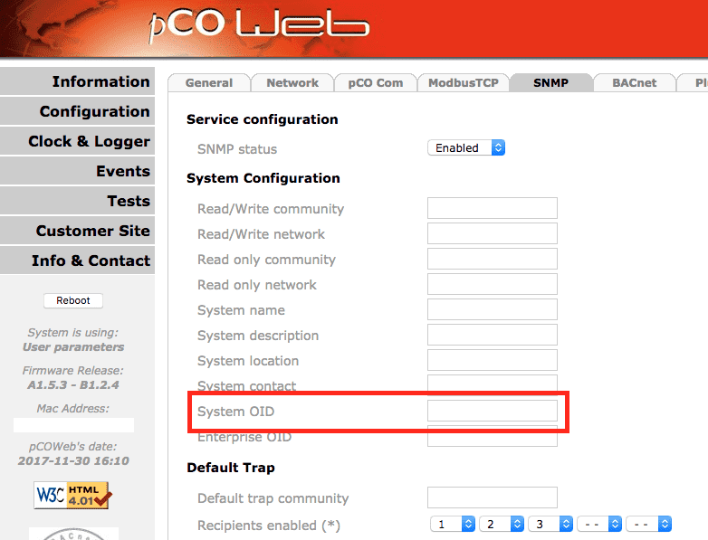

# Carel pCOweb Devices

The pCOWeb card connects the pCO system to networks that
use the HVAC protocols based on the Ethernet physical standard, such
as SNMP. The problem with this card: the implementation comes
from the final manufacturer of the HVAC (Heating, Ventilation and
Air Conditioning) system, not from a standard given by Carel. Thus, each
pCOweb card has a different configuration that needs a different MIB,
related to the manufacturer's implementation.

The main problem: by default, LibreNMS discovers this card as pCOweb,
and not as your real manufacturer, as it must. There is a solution
for this problem. But it is independent of LibreNMS, and you must
first configure your pCOWeb through the admin interface.

## Accessing the pCOWeb card

Log on to the configuration page of the pCOWeb card. The pCOWeb interface is not always available at the ip directly, but at a subdirectory. If you cannot get to the configuration page directly, try `<ip address>/config`. The default username and password is `admin/fadmin`. Modern browsers make you enter this 2 or 3 times.

## Configuring the pCOweb card SNMP for LibreNMS

First, configure your SNMP card with the admin
interface. On an SNMP tab in the configuration menu, you can
select a System OID and an Enterprise OID. This is not easy. But from this
information, we made a "standard" for all implementations of Carel
products with LibreNMS.

The base Carel OID is 1.3.6.1.4.1.9839. To this OID, we add the
Enterprise OID of the final manufacturer. You can find all enterprise OIDs
[at this
link](https://www.iana.org/assignments/enterprise-numbers/enterprise-numbers). With
this, we can create specific support for this device. Librenms uses this value to find which HVAC device is connected to the pCOWeb card.

Example for the Rittal IT Chiller that uses a pCOweb card:

1. Base Carel OID : **1.3.6.1.4.1.9839**
1. Rittal (the manufacturer) base enterprise OID : **2606**
1. Adding value to identify this device in LibreNMS : **1**
1. Complete System OID for a Rittal Chiller using a Carel pCOweb card: **1.3.6.1.4.1.9839.2606.1**
1. Use **9839** as Enterprise OID

With this method, the pCOWeb card operates as a different device. In reality, the pCOWeb card only puts the "enterprise OID" in the position of the vendor id in the OID.

The table below shows the necessary values for devices that are already supported.

## Supported devices

LibreNMS is ready for the devices in this table. You must only
configure your pCOweb card with the applicable System OID and Enterprise OID:

| Manufacturer  | Description   | System OID                    | Enterprise OID    |
|-------------- |-------------  |----------------------------   |----------------   |
| Rittal        | IT Chiller    | 1.3.6.1.4.1.9839.2606.1       | 9839              |
| Rittal        | LCP DX 3311   | 1.3.6.1.4.1.9839.2606.3311    | 9839.2606         |

## Unsupported devices
After you make the correct System OID for your SNMP card, you can
start the LibreNMS [new OS implementation](../../Developing/Support-New-OS.md)
and use this new OID as the sysObjectID for the YAML definition file.
