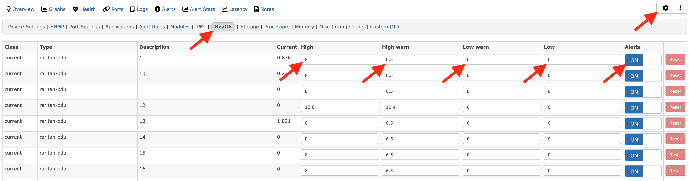
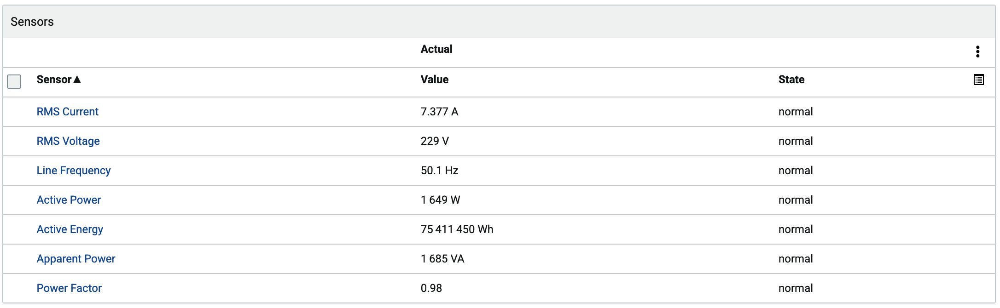
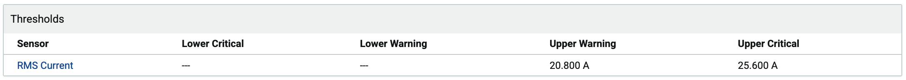
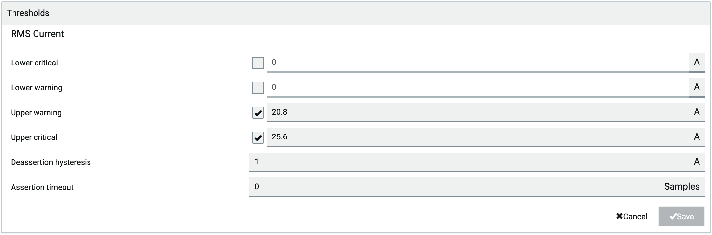

## Sensor Thresholds
The default threshold settings for many sensors are not good - when you add a Raritan device, many threshold alarms occur, unless you configured the thresholds on the device.

If threshold data is not important to you, you can set the thresholds to off in the device settings - highlighted below. You can also set good thresholds yourself.

Unfortunately, Raritan uses a threshold of 0 for 'the low value for this sensor is 0' and also for 'no threshold is configured'. Thus, we cannot remove these bad values.

As an alternative (and this is the best procedure), you can configure the thresholds on the devices themselves. Then LibreNMS finds them automatically.

You can do this for many devices at the same time with the JSON-RPC API or RedFish.
* https://pypi.org/project/raritan/4.3.0.51180/
* https://www.raritan.com/support/product/pdu-g2

For a small number of devices (or with sufficient patience), you can configure the thresholds on the device through the GUI - but the setting is not easy to find.

Hysteresis and deassert are advanced settings - do not change these unless you know their effects.

For an inlet:
* click 'Inlets' on the left side
* click one of the sensor types as shown below

* click on the available thresholds for that sensor

* you can now edit the thresholds - the 'disabled' thresholds are set to zero, thus you must enable and change these

For an outlet:
* click 'Outlets' on the left side
* select the outlet that you want to configure
* click one of the sensor types as shown below

* click on the available thresholds for that sensor

* you can now edit the thresholds - the 'disabled' thresholds are set to zero, thus you must enable and change these

## Known Sensor Types

'supported' means that the YAML contains support for polling that sensor type. LibreNMS can possibly support each of the sensor types below. But test data is not available for those sensor types at this time.

| Sensor Type                | Supported | Index |
|----------------------------|-----------|-------|
| rmsCurrent                 | **Yes**   | 1     |
| peakCurrent                | No        | 2     |
| unbalancedCurrent          | No        | 3     |
| rmsVoltage                 | **Yes**   | 4     |
| activePower                | **Yes**   | 5     |
| apparentPower              | No        | 6     |
| powerFactor                | **Yes**   | 7     |
| activeEnergy               | No        | 8     |
| apparentEnergy             | No        | 9     |
| temperature                | **Yes**   | 10    |
| humidity                   | **Yes**   | 11    |
| airFlow                    | No        | 12    |
| airPressure                | No        | 13    |
| onOff                      | **Yes**   | 14    |
| trip                       | No        | 15    |
| vibration                  | No        | 16    |
| waterDetection             | No        | 17    |
| smokeDetection             | No        | 18    |
| binary                     | No        | 19    |
| contact                    | No        | 20    |
| fanSpeed                   | No        | 21    |
| surgeProtectorStatus       | No        | 22    |
| frequency                  | **Yes**   | 23    |
| phaseAngle                 | No        | 24    |
| rmsVoltageLN               | No        | 25    |
| residualCurrent            | No        | 26    |
| rcmState                   | No        | 27    |
| absoluteHumidity           | No        | 28    |
| reactivePower              | No        | 29    |
| other                      | No        | 30    |
| none                       | No        | 31    |
| powerQuality               | No        | 32    |
| overloadStatus             | No        | 33    |
| overheatStatus             | No        | 34    |
| displacementPowerFactor    | No        | 35    |
| residualDcCurrent          | No        | 36    |
| fanStatus                  | No        | 37    |
| inletPhaseSyncAngle        | No        | 38    |
| inletPhaseSync             | No        | 39    |
| operatingState             | No        | 40    |
| activeInlet                | No        | 41    |
| illuminance                | No        | 42    |
| doorContact                | **Yes**   | 43    |
| tamperDetection            | No        | 44    |
| motionDetection            | No        | 45    |
| i1smpsStatus               | No        | 46    |
| i2smpsStatus               | No        | 47    |
| switchStatus               | No        | 48    |
| doorLockState              | **Yes**   | 49    |
| doorHandleLock             | **Yes**   | 50    |
| crestFactor                | No        | 51    |
| length                     | No        | 52    |
| distance                   | No        | 53    |
| activePowerDemand          | No        | 54    |
| residualAcCurrent          | No        | 55    |
| particleDensity            | No        | 56    |
| voltageThd                 | No        | 57    |
| currentThd                 | No        | 58    |
| inrushCurrent              | No        | 59    |
| unbalancedVoltage          | No        | 60    |
| unbalancedLineLineCurrent  | No        | 61    |
| unbalancedLineLineVoltage  | No        | 62    |
| dewPoint                   | No        | 63    |
| mass                       | No        | 64    |
| flux                       | No        | 65    |
| luminousIntensity          | No        | 66    |
| luminousEnergy             | No        | 67    |
| luminousFlux               | No        | 68    |
| luminousEmittance          | No        | 69    |
| electricalResistance       | No        | 70    |
| electricalImpedance        | No        | 71    |
| totalHarmonicDistortion    | No        | 72    |
| magneticFieldStrength      | No        | 73    |
| magneticFluxDensity        | No        | 74    |
| electricFieldStrength      | No        | 75    |
| selection                  | No        | 76    |
| rotationalSpeed            | No        | 77    |
| transferSwitchBypassState  | No        | 78    |
| batteryLevel               | No        | 79    |
| installFaultStatus         | No        | 80    |
| transferSwitchOutputStatus | No        | 81    |
