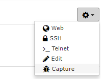
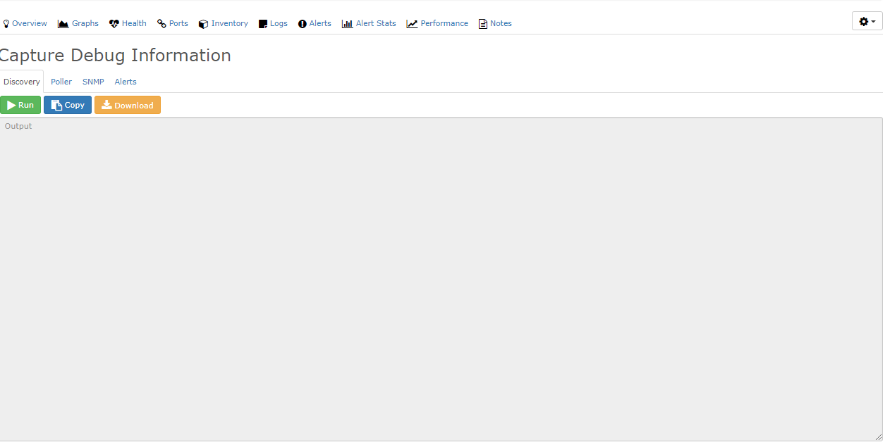

# Capture Debug Information

With this feature, you can run debug on Discovery, Poller, SNMP
and Alerts. The output can help you when you troubleshoot a device,
or when you ask the community for help.

To find this feature, go to the applicable device in the webui.
Click the settings icon menu on the far right. Then select
Capture.

## Discovery

Discovery runs and shows debug information.

## Poller

Poller runs and shows debug information.

## SNMP

SNMP does an SNMP Bulk Walk on the device and shows the information.

## Alerts

Alerts Capture is useful when you create alerts and must see
if your alert rule matches.

