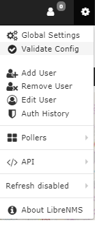
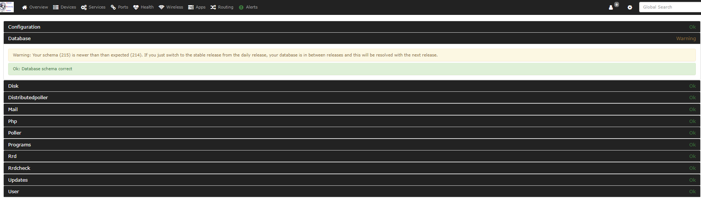

# Install validation

There are many configuration options. Thus, errors can occur.

To help with the usual problems, we made a simple validation
tool. At this time, the tool does these checks:

- Validate config.php from a php point of view, which includes
  whitespace in incorrect locations.
- Connect to your MySQL server to make sure that the credentials are
  correct.
- Check if you run the older alerting system.
- Check your rrd directory setup, if you do not run rrdcached.
- Check the disk space of the location where /opt/librenms is installed.
- Check the location of fping.
- Test if MySQL strict mode is enabled.
- Test for files that the librenms user does not own (if configured).
- More checks are added regularly.

Optionally, you can add -m and a module name to test that module.
The current modules are:

- mail - This validates your mail transport configuration.
- dist-poller - This tests your distributed poller configuration.
- rrdcheck - This tests your rrd files to see if they are
  unreadable or corrupted (a cause of broken graphs).

To run validate.php as `librenms`, run `./validate.php`
in your installation directory.

The output shows that the installation is correct, or it shows a list of
items that you must correct:

**OK** - This is good. You can ignore these items.

**WARN** - We recommend that you examine this.

**FAIL** - You must correct this!

# Validate from the WebUI

You can validate your LibreNMS installation from the WebUI. In the nav
bar, click the small Gear Icon -> Validate Config.

Run validate in the WebUI and in the CLI, because
they do different tests.

 

Then you see the results of validate.

Below is an example of the results.

